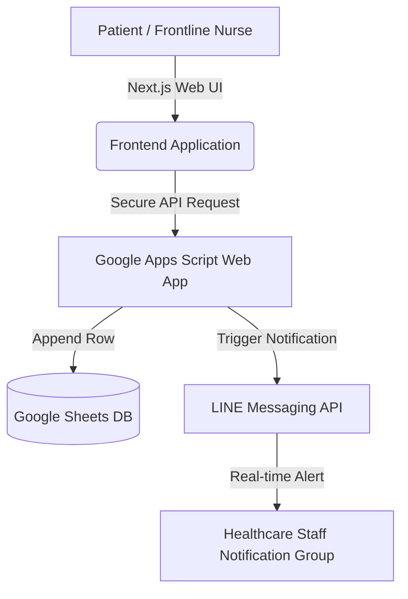

# Patient Registration System: Official Municipal Project

A lightweight, user-centered patient registration system built around nurses’ real-world workflows and clinical requirements. Designed for community hospitals to streamline registration and **reduce patient registration calls by approximately 80%** at zero infrastructure cost.

---

## Key Architectural Highlights & Engineering Decisions

- **Zero-Infrastructure Cost:** Built entirely on a decoupled architecture using free, open-source utilities and cloud APIs, eliminating server maintenance for resource-limited public healthcare centers.
- **User-Centric Data Layer:** Leverages Google Sheets as an accessible, real-time reactive database for immediate on-site verification by nursing staff with zero training overhead.
- **Fail-Safe Operation Mindset:** Implemented as a localized, independent buffering layer for registration queues to guarantee 100% uptime, ensuring core hospital systems (HOSxP) are strictly isolated from high-concurrency ingestion risks.

---

## Features

- Register new patients through a dynamic Next.js web application.
- Send automated, real-time LINE notifications to both patients and healthcare staff upon registration.
- Automatically store and sync registration data into Google Sheets acting as a headless data store.
- Includes isolated SQL compilation scripts (e.g., `hosxp-opd-income-report.sql`) for administrative revenue cross-checking without touching live production tables.
- Fully customizable UI tailored for low-lit clinical environments (background colors, accessible text styles).

---

## System Architecture & Data Flow



---

## Requirements & Tech Stack

- **Frontend / UI**: Next.js 14, Tailwind CSS, Vercel Hosting
- **Serverless Backend**: Google Apps Script (Web App Engine)
- **Data Storage**: Google Sheets API (Configured as Headless Data Store)
- **Communication Suite**: LINE Messaging API
- **Development Tools**: VS Code

---

## How to Use

1. Clone the repository and install dependencies:

```bash
git clone https://github.com
cd registration
npm install
npm run dev
```

2. Open [http://localhost:3000](http://localhost:3000) to access the local development server.

3. Create a `.env` file in the project root and configure your environmental variables:

```bash
APPS_SCRIPT_WEB_APP_URL=your_google_apps_script_url
GOOGLE_SHEETS_API_KEY=your_google_sheets_api_key
```

---

## Usage Policy & Compliance

- This system is strictly developed for non-commercial use within public public healthcare infrastructure and local community organizations.
- Modification and functional extension are highly encouraged within related clinical networks.
- **Data Privacy:** Deployers must strictly enforce and comply with personal data protection regulations, including **Thailand PDPA** and **HIPAA-aligned privacy practices** (e.g., restricted access control lists on the destination Google Sheet).
- The developer assumes no responsibility for misuse or unauthorized distribution of this open-source template.

---

## Real-world Validation & Impact

This platform has been successfully deployed and validated in real-world clinical environments by the **Kamphaeng Phet Municipality**. The project and its impact on community healthcare workflows were featured on official government communication networks:

- **Official Municipality News Update:** [KPP Municipal News (ID: 124000)](https://www.kppmu.go.th/news-detail?hd=1&id=124000)
- **Public Impact Showcase Video:** [Official TikTok Report by @kpp.pr](https://www.tiktok.com/@kpp.pr/video/7506431498870902037)

---

## Author

**Ratchanon Noknoy**
- **Role:** Solo Software & Solutions Engineer
- **GitHub:** [ratchanon-noknoy2318](https://github.com/ratchanon-noknoy2318)
- **LinkedIn:** [linkedin.com/in/ratchanon-noknoy](https://www.linkedin.com/in/ratchanon-noknoy/)
